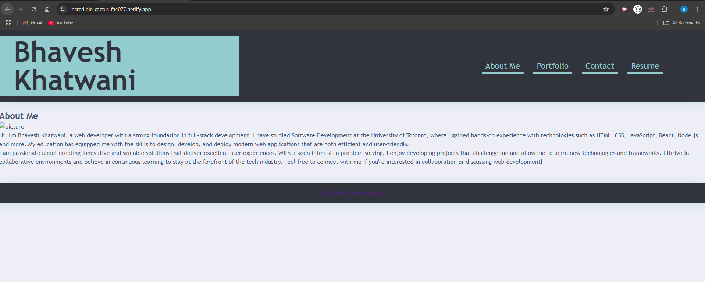

# myPortfolio

## Description

This project is a personal portfolio application built using React. It includes features such as a contact form, a downloadable resume link, and responsive design to ensure accessibility across devices. 
The project demonstrates proficiency in front-end development, React components, and form validation.

## Table of Contents

- [Features](#Features)
- [Credits](#credits)
- [License](#license)
- [Image](#Image)
- [Deployed-application-link](#Deployed-application-link)

## Features

- Contact Form: A user-friendly contact form with input validation and error notifications for required fields.
- Downloadable Resume: Users can download a PDF version of the resume.
- Responsive Design: The layout adjusts seamlessly for desktop, tablet, and mobile devices.
- Dynamic Components: Built with reusable React components for modular development.

## Credits

N/A

## License

MIT

## Image

## Deployed-application-link
https://incredible-cactus-fa4077.netlify.app/
